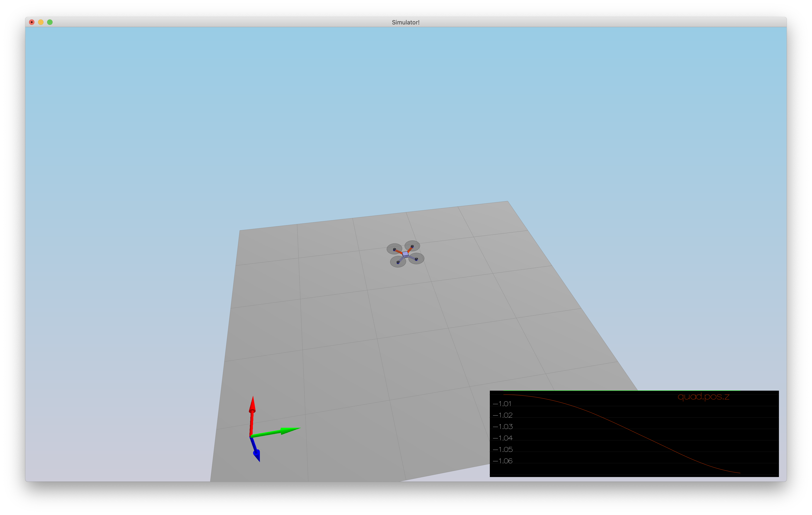
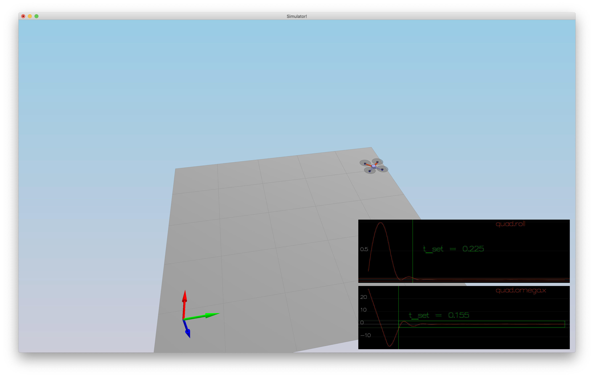
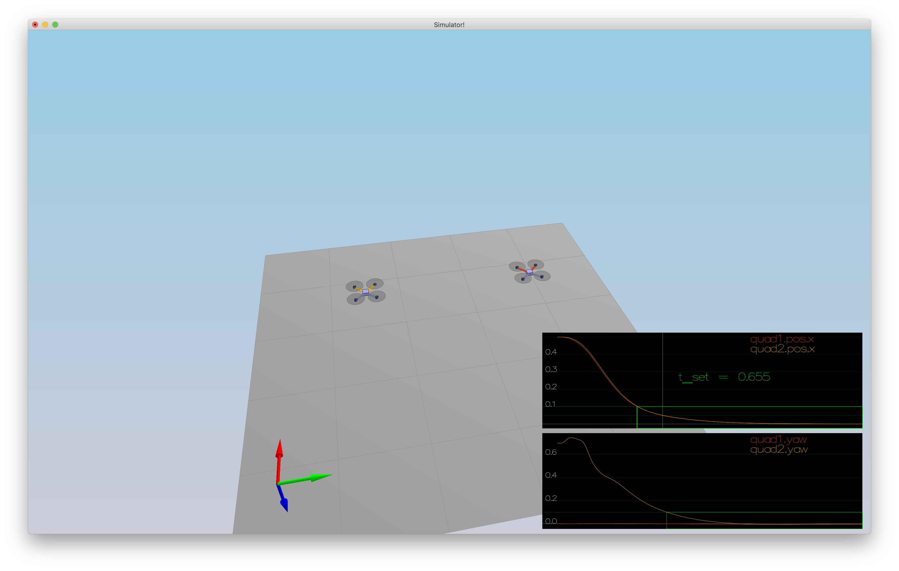
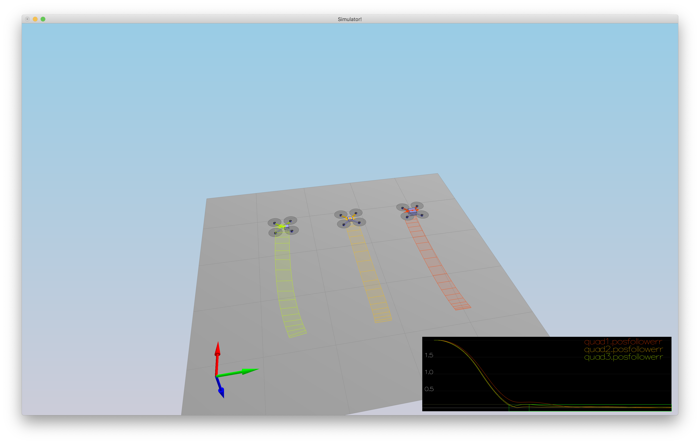
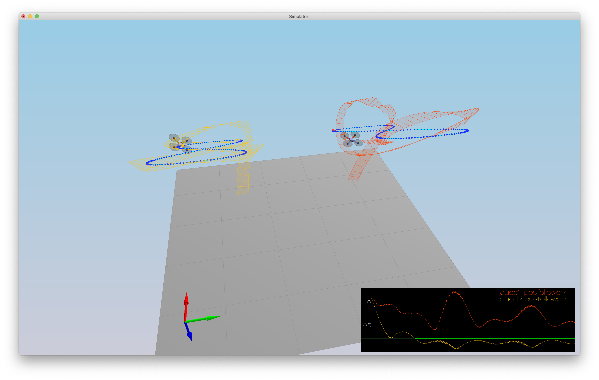

# Building a Controller

## Testing it out (Scenario 1)

Changing the mass to 0.5 stabilized the height of the drone. Now it hovers.



Command line output:

```text
Simulation #22 (../config/1_Intro.txt)
PASS: ABS(Quad.PosFollowErr) was less than 0.500000 for at least 0.800000 seconds
```


## Body rate control (Scenario 2)

Here a proportional controller is used:

- Compute error in angular velocities (body frame).
- Multiply this error with the gain parameter, a tunable parameter of the controller so that commanded moments will be proportional to the error.
- Multiply these rotational accelerations with inertia to get moments.
- `kpPQR` is tuned so that vehicle does not spin too quickly. 

See image and command line output in the roll/pitch section regarding scenario 2.

## Roll pitch control (Scenario 2)

Acceleration, collective thrust and vehicle attitude are used to find the desired pitch and roll rates:

- First derive collective acceleration from thrust by using the vehicle's mass.
- If there is thrust, set pitch and roll to get desired lateral acceleration.
- The rotation matrix transforms from local accelerations to body rates.
- Using `kpBank` the controller is tuned.



Command line output:

```text
Simulation #26 (../config/2_AttitudeControl.txt)
PASS: ABS(Quad.Roll) was less than 0.025000 for at least 0.750000 seconds
PASS: ABS(Quad.Omega.X) was less than 2.500000 for at least 0.750000 seconds
```

## Altitude controller (Scenario 3)

The altitude controller is a rather straightforward PID controller with feed forward:

- The rotation matrix is used to consider the effects from the roll and pitch angles.
- The parameters `kpPosZ`, `kpVelZ` and `kiPosZ` are used to tune the controller.
- The max ascent and descent rate are limited to to acceptable values.

See image and command line output in the yaw section regarding scenario 3.

## Lateral position control (Scenario 3)

The lateral position controller is a straightforward PD controller with feed forward:

- The parameters `kpPosXY` and `kpVelXY` are used to tune the controller.
- The acceleration is limited to acceptable values.

See image and command line output in the yaw section regarding scenario 3.

## Yaw control (Scenario 3)

The yaw controller is a P controller:

- The values are limited from negative to positive PI in rad/s.
- The parameter `kpYaw` is used to tune the controller.



Command line output:

```text
Simulation #29 (../config/3_PositionControl.txt)
PASS: ABS(Quad1.Pos.X) was less than 0.100000 for at least 1.250000 seconds
PASS: ABS(Quad2.Pos.X) was less than 0.100000 for at least 1.250000 seconds
PASS: ABS(Quad2.Yaw) was less than 0.100000 for at least 1.000000 seconds
```

## Calculating the motor commands given commanded thrust and moments

To implement the GenerateMotorCommands a system of equations needs to be solved. These convert thrust and moments into individual rotor forces.

These equations include:

- The sum of all forces is equal to the collective thrust.
- The force of engine 1 and 3 (to the left of the x-axis) minus the force of engine 2 and 4 (to the right of the x-axis) gives us the clockwise (positive) torque around the x-axis.
- The force of engine 1 and 2 (to the front of the y-axis) minus the force of engine 3 and 4 (to the back of the y-axis) gives uss the clockwise (positive) torque around the y-axis.
- The sum of rotor torques correspond to the torque of the quadrotor around its z-axis. Rotor 1 and 4 are spinning clockwise, thus set a counter-clockwise reactive angular momentum on the body, while 2 and 3 compensate for that. Considering kappa, forces can be deduced.

The dimensions of the vehicles are taken into account by considering the quadrotor its arm length and projecting it on the relevant axis.

Once the above is resolved for F1, F2, F3 and F4 the implementation in C++ is trivial.

## Controller successfully flies test trajectory (Scenario 4 and 5)

Both scenario 4 and 5 execute successfully.

### Scenario 4



Command line output:

```text
Simulation #31 (../config/4_Nonidealities.txt)
PASS: ABS(Quad1.PosFollowErr) was less than 0.100000 for at least 1.500000 seconds
PASS: ABS(Quad2.PosFollowErr) was less than 0.100000 for at least 1.500000 seconds
PASS: ABS(Quad3.PosFollowErr) was less than 0.100000 for at least 1.500000 seconds
```

### Scenario 5



Command line output:

```text
Simulation #33 (../config/5_TrajectoryFollow.txt)
PASS: ABS(Quad2.PosFollowErr) was less than 0.250000 for at least 3.000000 seconds
```
