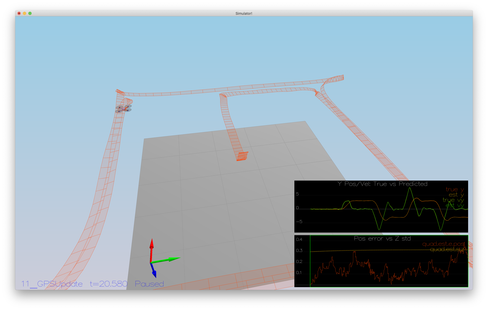

# Estimation

## Determine measurement noise standard deviation

### GPS X data

The below code has been used, after logging data for a full loop:

```python
import pandas as pd

df = pd.read_csv("config/log/Graph1.txt")
df.std()
# Output:
#  time          2.843365
#  Quad.GPS.X    0.715600
# dtype: float64
```

We conclude that the standard deviation is around 0.71. Here the standard deviation lies around 0.51. This standard deviation should suffice to capture about ~68% of the sensor measurements around the computed mean.

Experimentally, this is confirmed by the below log:

```text
Simulation #2 (../config/06_SensorNoise.txt)
PASS: ABS(Quad.GPS.X-Quad.Pos.X) was less than MeasuredStdDev_GPSPosXY for 68% of the time
PASS: ABS(Quad.IMU.AX-0.000000) was less than MeasuredStdDev_AccelXY for 70% of the time
```

### Accelerometer X data

Similarly, we used the following code for finding the standard deviation of the measurement noise for accelerometer X data, after some logging:

```python
import pandas as pd

df = pd.read_csv("config/log/Graph2.txt")
df.std()
# Output:
#  time           2.118040
#  Quad.IMU.AX    0.511134
# dtype: float64
```

Here the standard deviation lies around 0.51. This standard deviation should suffice to capture about ~68% of the sensor measurements around the computed mean.
Experimentally, this is confirmed by the below log:

```text
Simulation #2 (../config/06_SensorNoise.txt)
PASS: ABS(Quad.GPS.X-Quad.Pos.X) was less than MeasuredStdDev_GPSPosXY for 68% of the time
PASS: ABS(Quad.IMU.AX-0.000000) was less than MeasuredStdDev_AccelXY for 70% of the time
```

## Better rate gyro attitude integration scheme

The approach used here is the second outlined in the docstring. This matches the theory as outlined in section 7.1.2.
First, transform the current state into a quaternion, then use equation (43) to update the quaternion.
Both functions are already provided in `Quaternion.h`. Then derive roll, pitch and yaw from the resulting quaternion.
The remainder logic to fuse the attitude information by the accelerometers, which remains the same.

Now the test scenario succeeds with the following log message:

```text
Simulation #2 (../config/07_AttitudeEstimation.txt)
PASS: ABS(Quad.Est.E.MaxEuler) was less than 0.100000 for at least 3.000000 seconds
```

## Implement all of the elements of the prediction step for the estimator

`PredictState()` is a simple integration by adding change to the current position and velocity using a `dt` time step. However, the accelerations are defined in the body frame, therefore they need to be transformed.

We do not use `gyro` as we do not track attitude state except for yaw which we have already updated earlier.

In `GetRbgPrime()` the derivative of the Rotation matrix is calculated. This serves as input to the Jacobian of the transition function.
In `Predict()` the update step for the state covariance is added. This reflects the increase in uncertainty given a prediction.

Then the parameters `QPosXYStd` and `QVelXYStd` are tuned to ensure the covariance grows with the data.

## Implement the magnetometer update

This is a relatively straightforward update step:

- The measurement prediction is taking the current state value for yaw.
- The yaw difference (between measurement and estimated) is normalized to -pi .. pi.
- hPrime is filled, using the values for the Jacobian from section 7.3.2. of Estimation for Quadrotors.
- Some tuning of `QYawStd` was required for the tests to pass.

Now the test scenario succeeds with the following log message:

```text
Simulation #13 (../config/10_MagUpdate.txt)
PASS: ABS(Quad.Est.E.Yaw) was less than 0.120000 for at least 10.000000 seconds
PASS: ABS(Quad.Est.E.Yaw-0.000000) was less than Quad.Est.S.Yaw for 71% of the time
```

## Implement the GPS update

The estimator incorporate the GPS information in similar fashion as the previous step:

- The measurement prediction is taking the current state value for positions and velocities.
- hPrime is filled, using the values for the Jacobian from section 7.3.1. of Estimation for Quadrotors.
- Some de-tuning of `QPosXYStd` was required for the tests to pass.

Now the test scenario succeeds with the following log message:

```text
Simulation #2 (../config/11_GPSUpdate.txt)
PASS: ABS(Quad.Est.E.Pos) was less than 1.000000 for at least 20.000000 seconds
```

## Use controller from previous assignment

After swapping the controller flies. `kpYaw` and `kpBank` had to be tweaked to get scenario 10 to pass again.

Now the test scenario succeeds with the following log message:

```text
Simulation #3 (../config/11_GPSUpdate.txt)
PASS: ABS(Quad.Est.E.Pos) was less than 1.000000 for at least 20.000000 seconds
```

See below image for visualization:


